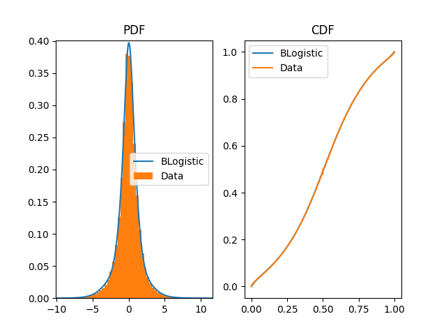

# BernsteinMartingaleNet
Jaeyoon Kim, Helen Liu, Shuo Zheng

Stanford CS 230 Project. Deep learning architecture for learning martingales.

*Figure: Fit of a Bernstein Logistic distribution to minutely log-returns of SPY. The left panel shows the probability density function (PDF) compared to the empirical histogram, and the right panel shows the cumulative distribution function (CDF) compared to the empirical CDF. This demonstrates the flexibility of the Bernstein Logistic model in capturing the distributional shape of financial returns.*

## TODO
- [x] Add market data downloader - @Jaeyoon
- [x] Add Bernstein Logistic Distribution library - @Jaeyoon
- [ ] Add Distribution learning example on independent data - @Jaeyoon
- [ ] Demonstrate how distribution changes based on looking at $x_{t-1}$
- [ ] Explore different datasets
- [ ] Train a RNN a short time horizon (maybe 8 minute look back?)
- [ ] Explore how to account for time of day
