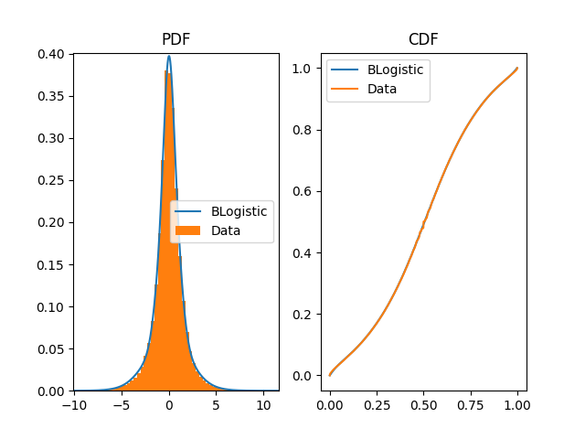

# BernsteinMartingaleNet
Jaeyoon Kim, Helen Liu

Stanford CS 230 Project. Deep learning architecture for learning martingales.

This project models the the distribution of the intraday S&P 500 returns using deep learning. We introduce a new probability distribution head called the Bernstein Logistic Distribution.



*Figure: Fit of a Bernstein Logistic distribution to minutely log-returns of SPY. The left panel shows the probability density function (PDF) compared to the empirical histogram, and the right panel shows the cumulative distribution function (CDF) compared to the empirical CDF. This demonstrates the flexibility of the Bernstein Logistic model in capturing the distributional shape of financial returns.*

## Getting Started
To download necessary dependencies, run
```
pip install -r requirements.txt
```

To train a sample model, run 
```
python TrainModel.py -o MichenkowResults/BLogistic16 -d BLogistic -p 16
```